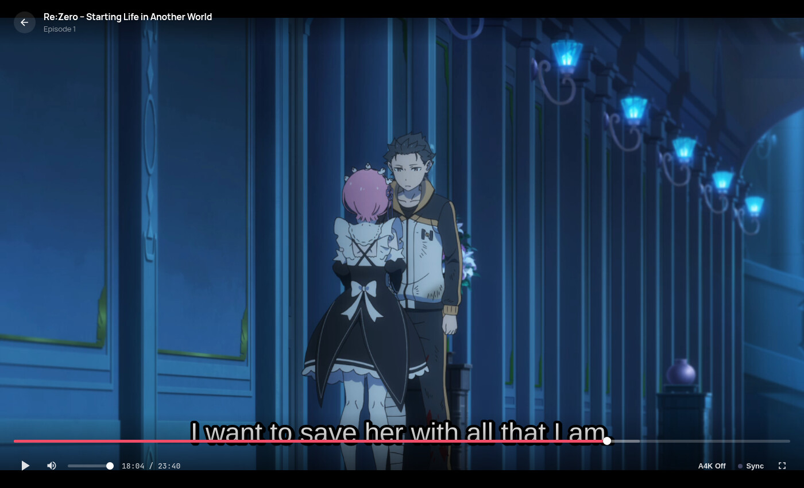
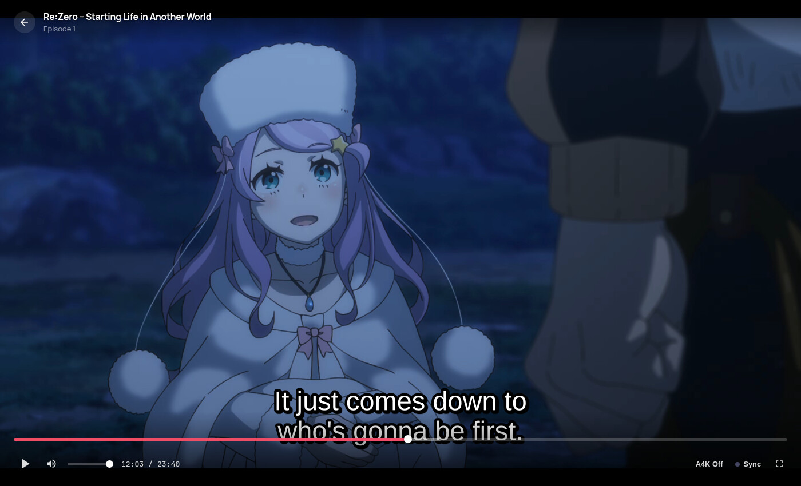
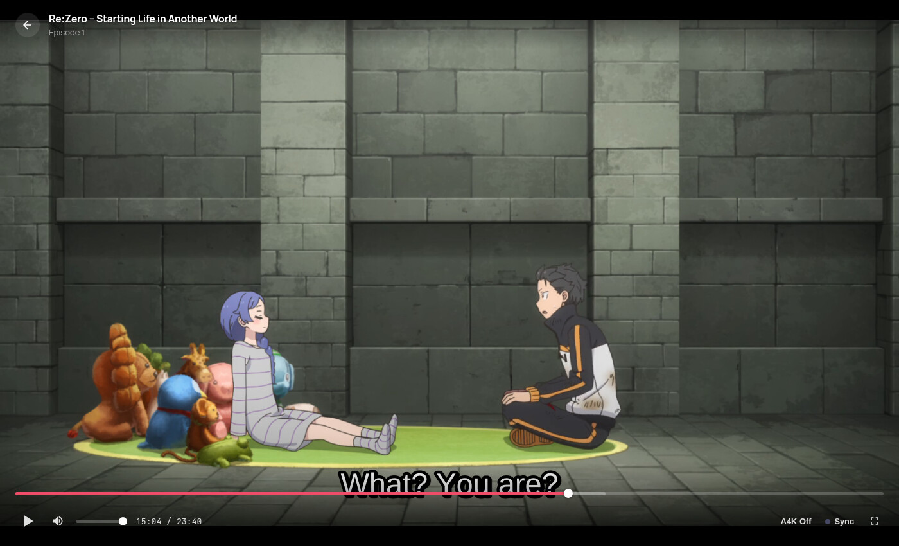
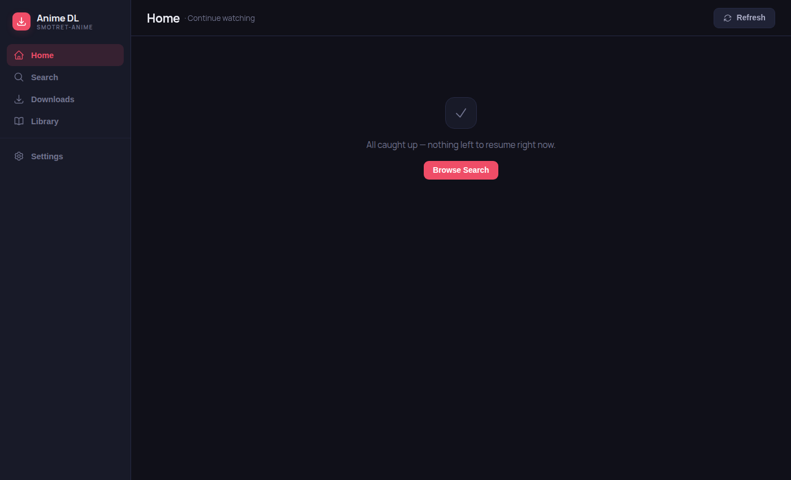

<div align="center">


# Anime DL

**A modern desktop app to download, organize, and watch anime from [smotret-anime.ru](https://smotret-anime.ru) (anime365).**

<p>
  <a href="https://github.com/mikkerlo/anime-downloader/releases/latest"></a>
  
  <a href="https://github.com/mikkerlo/anime-downloader/actions/workflows/check.yml"></a>
  
  <br />
  
  
  
</p>

</div>

Anime DL is more than a downloader — it has a built-in player with MKV streaming, Anime4K upscaling, and native ASS subtitles, two-way Shikimori sync that works offline, watch-together via Syncplay, and local OP/ED skip detection.

<p align="center">
  
</p>

## Contents

- [Features](#features)
- [Screenshots](#screenshots)
- [Download](#download)
- [Quick Start](#quick-start)
- [Development](#development)
- [Project Structure](#project-structure)
- [Contributing](#contributing)
- [Acknowledgements](#acknowledgements)
- [License](#license)

## Features

### 📥 Downloading

- **Search & browse** the full anime365 catalog.
- **Per-episode translation picker** — subtitles, voice-over, or raw, with multiple authors supported and several translations kept side by side.
- **Resumable downloads** of video + subtitles, backed by a persistent queue that survives restarts.
- **Automatic MKV merge** via ffmpeg — downloaded automatically on first launch, no manual setup.
- **Bandwidth & concurrency limits** to keep downloads from saturating your connection.

### ▶️ Built-in player

- **Instant MKV streaming** through MediaSource Extensions — no waiting for a full remux — with frame-accurate seeking.
- **HEVC (H.265)** playback, with an automatic **H.264 transcode fallback** on platforms without a hardware HEVC decoder.
- **Anime4K upscaling** via WebGPU compute shaders (Mode A / B / C) for real-time enhancement.
- **Native ASS/SSA subtitles** rendered with [JASSUB](https://github.com/ThaUnknown/jassub) (libass) — full styling, positioning, fonts, and sign translations preserved.
- **Quality & translation switching** mid-playback, seek-time preview, and previous/next episode with auto-advance.
- **Auto-resume** — picks up where you left off and reports progress back to Shikimori.

### 🔍 Discovery & Shikimori

- **Two-way Shikimori sync** of watch status and episode progress.
- **Works offline** — edits are queued locally and synced (with conflict resolution) once you reconnect.
- **Auto-download** new episodes for anime you're currently watching.
- **Friends' activity** — friends' status and score on each anime, plus a global recent-activity feed.
- **Series chronology** and a **release calendar**.

### 👥 Watch Together

- **Syncplay support** — keep playback in lockstep with friends. Compatible with the [Syncplay](https://syncplay.pl) protocol and the reference mpv/VLC desktop clients.

### ⏭️ Skip detection

- **Local OP/ED detection** by fingerprinting your own downloaded episodes (Chromaprint) — accurate to your encodes, no reliance on a different reference release.

### 🗄️ Library & storage

- **Library** of starred and downloaded anime with offline detail caching.
- **Hot/cold storage** with automatic move of watched episodes.
- **Auto-update** via `electron-updater`.

## Screenshots

<div align="center">

<table>
  <tr>
    <td width="50%">
      <br />
      <sub><b>Native ASS/SSA subtitles</b> — rendered with libass/JASSUB, full styling and positioning preserved.</sub>
    </td>
    <td width="50%">
      <br />
      <sub><b>Instant MKV streaming</b> — frame-accurate seeking with mid-playback quality, translation, and Anime4K switching.</sub>
    </td>
  </tr>
  <tr>
    <td colspan="2" align="center">
      <br />
      <sub><b>Home</b> — continue-watching dashboard with dark-theme navigation.</sub>
    </td>
  </tr>
</table>

</div>

## Download

Grab the latest build for your platform from the [**Releases**](https://github.com/mikkerlo/anime-downloader/releases/latest) page:

| Platform    | Download                       |
| ----------- | ------------------------------ |
| **Windows** | `.exe` (x64)                   |
| **macOS**   | `.dmg` / `.zip` (Apple Silicon) |
| **Linux**   | `.AppImage` or `.deb` (x86_64) |

Builds are produced automatically by CI for every release.

## Quick Start

1. Install and launch the app.
2. Open **Settings › General** and paste your **smotret-anime.ru API token** (required to download and stream episodes).
3. On first run, ffmpeg/ffprobe are downloaded automatically to the app-data directory — nothing to install.
4. Search for an anime, choose episodes and a translation, then download or play directly.

## Development

Requires **Node.js 20+** and npm.

```bash
npm install
npm run dev          # run with hot reload
```

Useful scripts:

```bash
npm run build        # compile to out/
npm run typecheck    # type-check (node + web)
npm run lint         # ESLint
npm run format:check # Prettier
npm run test         # Vitest (unit + integration)
npm run test:e2e     # Playwright (Electron) e2e
```

Package a desktop build:

```bash
npm run pack:win     # Windows
npm run pack:linux   # Linux
npm run pack:mac     # macOS
```

Before pushing, the full quality gate should be green: `typecheck` · `lint` · `format:check` · `test` · `build`. See [`CLAUDE.md`](CLAUDE.md) for project conventions and the contribution workflow, and [`docs/testing.md`](docs/testing.md) for the test layers and coverage gates.

## Project Structure

```
src/
  main/        Electron main process — App controller, IPC routers, services, streaming
  preload/     contextBridge IPC bridge (window.api)
  renderer/    Vue 3 + Pinia frontend — views, stores, composables, components
  shared/      Single-source IPC channel contract + ambient types
docs/          Per-subsystem architecture docs
```

[`DESIGN.md`](DESIGN.md) is the architecture index — it links to a per-subsystem page under [`docs/`](docs/) for each part of the app.

## Contributing

Issues and pull requests are welcome. The [issues labelled **Ready for Implementation**](https://github.com/mikkerlo/anime-downloader/issues?q=is%3Aopen+is%3Aissue+label%3A%22Ready+for+implementation%22) are a good place to start. Project conventions, the commit/release flow, and the IPC pattern are documented in [`CLAUDE.md`](CLAUDE.md).

## Acknowledgements

- [smotret-anime.ru / anime365](https://smotret-anime.ru) — catalog and streaming source
- [Shikimori](https://shikimori.one) — watchlist sync
- [Anime4K](https://github.com/bloc97/Anime4K) — real-time upscaling shaders
- [JASSUB](https://github.com/ThaUnknown/jassub) / libass — subtitle rendering
- [FFmpeg](https://ffmpeg.org) — remuxing, transcoding, and merging
- [Syncplay](https://syncplay.pl) — watch-together protocol

## License

Licensed under the **ISC** license.
